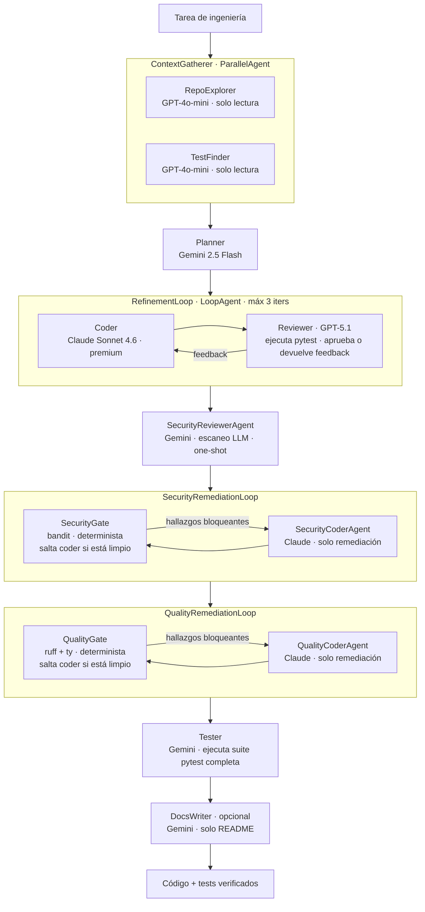

[English](README.md) | [Español](#equipo-de-desarrollo-multiagente-autónomo)

---

# Equipo de Desarrollo Multiagente Autónomo

**Un pipeline determinista e independiente del modelo que convierte una tarea de ingeniería en código verificado + tests — de extremo a extremo, sin intervención humana en cada paso.**

> Caso de estudio basado en un prototipo funcional. El código fuente completo y una demostración en vivo están disponibles bajo solicitud.

---

## Resumen ejecutivo

Dado un input como *"agrega una función `slugify` con tests"* o *"corrige este bug sin romper la suite existente"*, el sistema planifica, explora el repositorio, escribe el código, lo revisa, ejecuta la suite de tests real, escanea vulnerabilidades de seguridad, aplica reglas de lint/tipos y documenta el resultado — de forma autónoma.

- **Pipeline determinista de 8 etapas** construido sobre Google ADK (Python) con `SequentialAgent`, `LoopAgent`, `ParallelAgent` — cero tokens gastados en control de flujo.
- **Multi-LLM por rol:** Claude Sonnet 4.6 (coder), GPT-5.1 (reviewer), Gemini 2.5 Flash (planner, seguridad, tester, docs), GPT-4o-mini (explorer) — vía LiteLLM / OpenRouter. Una línea de config para cambiar cualquier rol.
- **Evaluado, no asumido:** 18/18 casos de eval automatizados en verde, cubriendo 8 tipos de tarea (LLM-as-judge + checks deterministas).
- **El coste es una métrica de primera clase:** un run completo de 18 casos cuesta **$1.51** (todos los roles instrumentados con precios reales de los modelos); el Coder funcional solo = 72% del gasto; todos los roles baratos juntos = centavos. Fuente: `tests/eval/last_run_metrics.json`.
- **Camino nativo a GCP:** ADK despliega a Vertex AI Agent Engine, Cloud Run o GKE cambiando el `deployment_target`; se usa Docker para el prototipo para mantenerlo independiente de la nube durante el desarrollo.

---

## El Problema y la Tesis de Diseño

Los LLMs escriben código, pero un modelo crudo no es un *sistema*. Para entregar de forma confiable necesitas todo lo que rodea al modelo: un workspace confinado, ejecución de herramientas, loops de verificación, control de costes y guardrails. Este proyecto es un ejercicio exactamente en eso.

**La tesis:** para trabajo con estructura conocida (planificar → codificar ↔ revisar → testear), el **control de flujo debe ser código determinista**, y el LLM debe reservarse para el juicio *dentro* de cada etapa — no para decidir el flujo entre etapas. Esa elección mantiene el sistema predecible, depurable, económico de operar y fácil de extender.

En concreto: toda la orquestación usa `SequentialAgent`, `LoopAgent` y `ParallelAgent` de ADK — primitivas deterministas que no queman tokens. Un router LLM gastaría tokens en cada llamada para responder "¿qué agente sigue?" e introduciría varianza. El backbone determinista elimina esa clase de coste e incertidumbre por completo.

---

## Arquitectura

Verificada contra `app/agent.py`. Los 9 nodos nombrados (7 obligatorios + 2 sub-bucles de remediación opcionales + DocsWriter) coinciden con el agente `dev_team_pipeline` en producción.

**Notas de diseño clave:**

- **Loop generator-critic acotado.** El loop Coder↔Reviewer tiene un tope duro de `max_iterations` más una herramienta `exit_loop` que el Reviewer llama al aprobar. El Reviewer *ejecuta la suite de tests real* antes de aprobar — la aprobación está respaldada por salida real de pytest, no por una suposición.
- **Dos capas para seguridad.** El `SecurityReviewerAgent` es un escaneo LLM de una sola pasada (barato, juzga intención). Aguas abajo, el `SecurityRemediationLoop` corre `bandit` de forma determinista — eso es lo que realmente actúa como gate. El gate determinista corre en milisegundos y se salta el `SecurityCoderAgent` por completo cuando el código está limpio.
- **Mismo patrón para calidad.** El `QualityRemediationLoop` corre `ruff` (solo errores pyflakes, no nits de estilo) y `ty` (errores de tipos) de forma determinista. Ambas herramientas están limitadas a los archivos de módulo — no a los tests generados — para evitar falsos positivos de inputs intencionalmente extremos en los tests.
- **Higiene de contexto.** Los agentes se comunican a través de `output_key` + lecturas templadas con `{placeholder}` sobre estado de sesión compartido. Cada agente ve solo lo que necesita; el historial se descarta donde solo se necesita estado (`include_contents='none'`).
- **Aislamiento de workspace por invocación.** Cada tarea escribe en su propio subdirectorio `workspace/task_{invocation_id}/`. El harness de eval corre casos en paralelo; este aislamiento vía `ContextVar` evita que los casos se pisen entre sí.

---

## Decisiones de Ingeniería Clave

| Decisión | Qué demuestra |
|---|---|
| Orquestación determinista (`Sequential`/`Loop`/`Parallel`) en lugar de un router LLM | Pensamiento sistémico; cero tokens en control de flujo; comportamiento predecible y depurable |
| Routing multi-LLM por rol (barato vs. premium; proveedores distintos para generador vs. crítico) | Selección de modelos bajo restricciones de coste; diversidad de proveedores como cobertura de confiabilidad |
| El Reviewer ejecuta pytest real antes de aprobar | Fundamentar las decisiones del agente en señales de ejecución verificables, no en suposiciones alucinadas |
| Gate de seguridad determinista (`bandit`) que salta el coder con código limpio | Disciplina MLOps: guardrails que no queman presupuesto en el camino feliz |
| Gate de calidad determinista (`ruff` + `ty`) que salta el coder con código limpio | Mismo principio aplicado a calidad de código — coste cero cuando es correcto |
| Instrumentación de coste por rol con precios reales del modelo | FinOps de producción para sistemas LLM: convierte regresiones de coste en señales detectables |
| Aislamiento de workspace por invocación vía `ContextVar` | Eval paralelo seguro; sin estado mutable compartido entre tareas concurrentes |
| Funciones factory para construir agentes (sin singletons a nivel de módulo) | Comprensión profunda del comportamiento de doble-import del harness de eval de ADK |
| Decisiones documentadas *antes* del código (WORKLOG + docs de diseño) | Registro de auditoría orientado a stakeholders de las compensaciones hechas; revisable sin leer el diff |

---

## Resultados (Medidos, No Supuestos)

### Evaluación: 18/18 casos en verde

Los 18 casos en `tests/eval/evalsets/basic.evalset.json` pasan con score = 1.0 (umbral ≥ 0.8).

| Tipo de tarea | Casos | Descripción |
|---|---|---|
| Feature greenfield | 2 | Módulo nuevo + tests desde cero |
| Bugfix | 2 | Corregir error lógico, mantener tests existentes en verde |
| Refactor | 1 | Separar monolito en dos archivos sin cambiar comportamiento |
| Rojo → verde | 2 | Tests existentes fallando; reparar la implementación |
| Brownfield (agregar) | 3 | Agregar a un repo existente respetando sus convenciones |
| Security-aware | 4 | 3 fixtures con vulnerabilidades plantadas (shell injection, `eval()`, SQL injection) + 1 limpio |
| Quality gate | 2 | 1 fixture con problemas ruff/ty plantados + 1 greenfield limpio |
| Docs | 2 | Greenfield + brownfield, generación de README |
| **Total** | **18** | |

**Método de scoring:** 4 métricas rubric por caso (2 de uso de herramientas, 2 de respuesta final) evaluadas por GPT-4o-mini (`rubric_based_tool_use_quality_v1` + `rubric_based_final_response_quality_v1`). Umbral 0.8; todos marcaron 1.0.

### Coste: $1.51 para 18 casos

Fuente: `tests/eval/last_run_metrics.json`, `generated_at: 2026-05-22T15:50:33`.

| Rol | Modelo | Llamadas | Coste USD | % del total |
|---|---|---|---|---|
| Coder (funcional) | Claude Sonnet 4.6 | 61 | $1.09 | 72.2% |
| SecurityCoder (remediación) | Claude Sonnet 4.6 | 9 | $0.16 | 10.9% |
| Reviewer | GPT-5.1 | 57 | $0.14 | 9.2% |
| QualityCoder (remediación) | Claude Sonnet 4.6 | 3 | $0.057 | 3.8% |
| Planner | Gemini 2.5 Flash | 18 | $0.021 | 1.4% |
| DocsWriter | Gemini 2.5 Flash | 36 | $0.015 | 1.0% |
| Explorer (×2 agentes) | GPT-4o-mini | 86 | $0.012 | 0.8% |
| Tester | Gemini 2.5 Flash | 36 | $0.006 | 0.4% |
| SecurityReviewer | Gemini 2.5 Flash | 18 | $0.003 | 0.2% |
| **TOTAL** | | **324** | **$1.51** | **100%** |

Los tres roles Claude (coder funcional + remediación de seguridad + remediación de calidad) representan **$1.31 (86.9%)** del gasto total — todo lo demás son centavos. Por tarea: $0.034 – $0.141, media $0.084. Esta línea base convierte las regresiones de coste en algo que se puede *detectar por rol*.

### Efectividad de los gates: cero overhead de remediación con código limpio

De 18 casos:
- **14 completamente limpios** — cero pasadas de remediación de ningún tipo; ambos gates deterministas corrieron en < 1 segundo y costaron ~$0.
- **3 remediaciones de seguridad** — `bandit` detectó un hallazgo bloqueante; `SecurityCoderAgent` lo remedió (antes = 1 hallazgo → después = 0 hallazgos).
- **1 remediación de calidad** — `ruff` detectó 3 hallazgos bloqueantes en un fixture brownfield; `QualityCoderAgent` los remedió (antes = 3 → después = 0).

La regla "cero pasadas extra del Coder con código limpio" está aplicada estructuralmente por el gate determinista, no por instrucción.

---

## Evaluación y Mejora Continua

La calidad se trata como un loop de ingeniería, no como un instinto:

1. **Escribir 1–2 casos de eval núcleo** para el comportamiento más importante.
2. **Correr la suite** — LLM-as-judge (`gpt-4o-mini`, económico) + checks deterministas (llamadas a herramientas, señales de test pass/fail).
3. **Leer fallos, corregir instrucción / herramienta / flujo del agente, volver a correr, ampliar la cobertura.**

Disciplina que dio resultados repetidamente: **correr un caso representativo barato antes de la suite completa** para encontrar bugs de confiabilidad al 1× del coste en lugar de N×. Varios problemas a nivel de framework se encontraron de esta forma y se convirtieron en "gotchas verificados" (ver abajo) para que nunca tengan que re-descubrirse.

---

## Gotchas de Ingeniería Verificados

Cuatro problemas reales encontrados y resueltos durante el desarrollo — cada uno es evidencia de profundidad, no un ejemplo de libro de texto:

1. **Los agentes ADK multi-archivo necesitan funciones factory, no singletons a nivel de módulo.** El harness de eval importa el paquete bajo dos nombres de módulo distintos. Reusar la misma instancia de sub-agente en esas importaciones dispara un error de ADK: *"agent already has a parent."* Solución: cada `build_*_agent()` es una factory que devuelve un grafo fresco. (Fuente: `app/agent.py:build_root_agent`)

2. **OpenRouter factura prompt + `max_output_tokens` por adelantado.** Con saldo bajo y un `max_output_tokens` alto por defecto (ADK default ~65k), las requests fallan con HTTP 402 a mitad del run — aunque el output real sea pequeño. Solución: limitar `MAX_OUTPUT_TOKENS` (env var, default 8000) y aplicarlo a todo el árbol con un único recorrido. Verificado no-truncando en los 18 casos. (Fuente: `app/agent.py:_cap_output_tokens`)

3. **`ty` hereda el `[tool.ty]` del proyecto cuando corre bajo el directorio del proyecto.** El config del proyecto suprimía errores `invalid-return-type` — haciendo que el gate de calidad ignorara silenciosamente errores de tipos reales en el código del workspace (falsos negativos). Solución: pasar `--config-file` apuntando a un config vacío aislado para forzar los defaults. (Fuente: `app/tools/quality.py`)

4. **`ruff` respeta `.gitignore` cuando se le da un argumento de directorio.** El workspace root está en `.gitignore`, por lo que `ruff check .` reporta cero hallazgos incluso en archivos con errores reales (limpio falso). Solución: pasar rutas de archivo explícitas, nunca un directorio. (Fuente: `app/tools/quality.py`)

---

## Stack Tecnológico

`Python 3.11` · `Google ADK` (Agent Development Kit) · `LiteLLM` + `OpenRouter` · `Claude Sonnet 4.6` · `GPT-5.1` · `Gemini 2.5 Flash` · `GPT-4o-mini` · `pytest` · `ruff` · `bandit` · `ty` · `Docker` · `uv`

**Nota de portabilidad a GCP.** Google ADK es el mismo framework usado para Vertex AI Agent Engine. Cambiar del target Docker prototipo a `cloud_run` o `agent_engine` es una modificación de una línea en el config de despliegue de `agents-cli` — la lógica de agentes, herramientas y suite de eval no se tocan. Las integraciones con BigQuery y Kubernetes seguirían el mismo camino nativo de ADK.

---

## Qué Demuestra para un Rol de AI Engineering

| Requisito de la vacante | Evidencia en este proyecto |
|---|---|
| Construir agentes autónomos con frameworks modernos | Pipeline de 8 etapas en Google ADK; agentes `Sequential`, `Loop`, `Parallel`; ejecución de herramientas confinada |
| Modelos Gemini | Planner, SecurityReviewer, Tester, DocsWriter usan Gemini 2.5 Flash vía OpenRouter |
| GCP-native (Vertex AI, Cloud Run, GKE) | ADK es el framework de agentes de Vertex AI; target Docker para prototipado, target GCP es un cambio de config |
| Arquitecturas RAG | *(No implementado en este proyecto — puente honesto: los patrones del harness y flujos agénticos se transfieren directamente; `agents-cli scaffold` incluye una plantilla `agentic_rag` construida sobre las mismas primitivas ADK)* |
| Python | Toda la lógica de agentes, herramientas, observabilidad y harness de eval en Python; `pytest` para testing |
| Optimizar prompts, evaluar modelos, mejorar en producción | Loop eval-fix con rubric de 4 métricas LLM-as-judge; baseline de coste por rol en `last_run_metrics.json`; cada iteración medida, no asumida |
| MLOps: Docker, Kubernetes | `Dockerfile` + `deploy/docker-compose.yml` para contenedorización portable; camino a GKE vía ADK |
| LLMs / NLP | Orquestación multi-LLM; ingeniería de prompts por rol de agente; eficiencia de tokens como restricción de diseño |
| Frameworks de agentes (LangChain / LlamaIndex) | Google ADK es de la misma categoría; mismos conceptos (herramientas, estado, orquestación multi-agente) con la API Python tipada de ADK |
| Manejo de stakeholders | `docs/WORKLOG.md` — cada decisión y compensación documentada *antes* del cambio de código; sirve como registro de auditoría para revisores que no leen diffs |

---

## Limitaciones y Próximos Pasos

Restricciones honestas de alcance — demostración de madurez de ingeniería, no ocultamiento de brechas:

- **Solo tareas de archivo único.** El pipeline actual está diseñado para pares módulo + test autocontenidos. Refactors multi-archivo en un repo grande o tareas que tocan múltiples PRs no están soportadas aún.
- **Placeholders opcionales frágiles.** El estado se pasa vía plantillas `{key}` en las instrucciones de los agentes. Si un agente upstream falla (error transitorio del LLM), un placeholder requerido `{key}` colapsa todo el run. El patrón de corrección (`{key?}` sintaxis opcional) se aplicó quirúrgicamente al `DocsWriter`; un barrido completo está pendiente. Documentado en `docs/WORKLOG.md`.
- **Docker configurado, no probado en carga.** El servicio está contenedorizado (`Dockerfile`, `deploy/docker-compose.yml`) y corre sin credenciales de GCP. No ha sido probado en carga ni desplegado a un entorno de staging.
- **RAG no implementado.** Este proyecto cubre flujos de trabajo de generación de código agéntico, no generación aumentada por recuperación. El harness de eval, los patrones multi-agente y el routing LiteLLM se transferirían a un sistema RAG; la capa de recuperación e indexación no está presente.
- **Cobertura de eval son funciones Python utilitarias.** Los 18 casos son tareas Python pequeñas y autocontenidas. La cobertura de codebases grandes, integraciones de APIs o lenguajes no-Python no está probada aún.
- **Máximo 3 iteraciones de refinamiento.** El loop Coder↔Reviewer está limitado a 3. En la práctica, los 18 casos convergieron en 1–2 iteraciones (un caso usó 2). El comportamiento en tareas genuinamente difíciles que requieran más pasadas es desconocido.

---

## Contacto

**Juan Camilo Restrepo Toro** — [juancamilorestrepotoro2000@gmail.com](mailto:juancamilorestrepotoro2000@gmail.com)

El código fuente completo y una demostración en vivo están disponibles bajo solicitud.

---

*Construido como exploración profunda en diseño de sistemas agénticos sobre Google ADK.*
