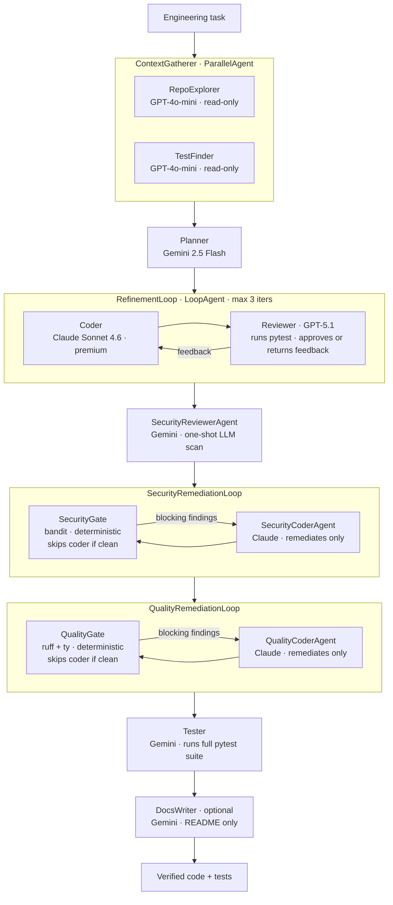

[English](#autonomous-multi-agent-development-team) | [Español](README.es.md)

---

# Autonomous Multi-Agent Development Team

**A deterministic, model-agnostic pipeline that turns an engineering task into verified code + tests — end to end, with no human in the loop per step.**

> Case study based on a working prototype. Full source and live walkthrough available on request.

---

## TL;DR

Given a task like *"add a `slugify` function with tests"* or *"fix this bug without breaking the existing suite"*, the system plans, explores the repo, writes code, reviews it, runs the real test suite, scans for security vulnerabilities, enforces lint/type rules, and documents the result — autonomously.

- **8-stage deterministic pipeline** built on Google ADK (Python) with `SequentialAgent`, `LoopAgent`, `ParallelAgent` — zero tokens spent on control flow.
- **Multi-LLM by role:** Claude Sonnet 4.6 (coder), GPT-5.1 (reviewer), Gemini 2.5 Flash (planner, security, tester, docs), GPT-4o-mini (explorer) — via LiteLLM / OpenRouter. One config line to swap any role.
- **Evaluated, not assumed:** 18/18 automated eval cases green across 8 task types (LLM-as-judge + deterministic checks).
- **Cost is a first-class metric:** a full 18-case eval run costs **$1.51** (all roles instrumented from live model prices); functional Coder alone = 72% of spend; all cheap roles combined = cents. Source: `tests/eval/last_run_metrics.json`.
- **GCP-native path:** ADK deploys to Vertex AI Agent Engine, Cloud Run, or GKE by switching `deployment_target`; Docker target used for the prototype to stay cloud-agnostic during development.

---

## The Problem & Design Thesis

LLMs write code, but a raw model is not a *system*. To ship reliably you need everything *around* the model: a confined workspace, tool execution, verification loops, cost control, and guardrails. This project is an exercise in exactly that.

**The thesis:** for work with a known structure (plan → code ↔ review → test), the **control flow should be deterministic code**, and the LLM should be reserved for judgment *inside* each step — not for routing between steps. That choice keeps the system predictable, debuggable, cheap to operate, and easy to extend.

Concretely: all orchestration uses ADK's `SequentialAgent`, `LoopAgent`, and `ParallelAgent` — deterministic primitives that burn no tokens. An LLM router would burn tokens on every call to answer "which agent next?" and introduce variance. The deterministic backbone eliminates that class of cost and unreliability entirely.

---

## Architecture

Verified against `app/agent.py`. All 9 named nodes (7 mandatory + 2 optional remediation sub-loops + DocsWriter) match the live `dev_team_pipeline` Sequential agent.

**Key design notes:**

- **Bounded generator–critic loop.** The Coder↔Reviewer loop has a hard `max_iterations` cap plus an `exit_loop` tool the Reviewer calls when it approves. The Reviewer *executes the real test suite* before approving — approval is grounded in actual pytest output, not a hunch.
- **Two-layer gate for security.** The `SecurityReviewerAgent` is a one-shot LLM scan (cheap, judges intent). Downstream, the `SecurityRemediationLoop` runs `bandit` deterministically — that's what actually gates a merge. The deterministic gate runs in milliseconds and skips the expensive `SecurityCoderAgent` entirely when the code is clean.
- **Same pattern for quality.** `QualityRemediationLoop` runs `ruff` (pyflakes errors only, not style nits) and `ty` (type errors) deterministically. Both tools are scoped to the module files — not the generated tests — to avoid false positives from deliberate edge-case inputs. Gates cost ~$0 when the code is clean.
- **Context hygiene.** Agents communicate through `output_key` + `{placeholder}` templated reads on shared session state. Each agent sees only what it needs; history is dropped where only state is required (`include_contents='none'`).
- **Per-invocation workspace isolation.** Each task writes to its own `workspace/task_{invocation_id}/` subdirectory. The eval harness runs cases in parallel; this `ContextVar`-based isolation prevents cases from clobbering each other.

---

## Key Engineering Decisions

| Decision | What it demonstrates |
|---|---|
| Deterministic orchestration (`Sequential`/`Loop`/`Parallel`) over an LLM router | Systems thinking; zero tokens on control flow; predictable, debuggable behavior |
| Multi-LLM routing by role (cheap vs. premium; diverse providers for generator vs. critic) | Model selection under cost constraints; provider-level diversity as a reliability hedge |
| Reviewer runs real pytest before approving | Grounding agent decisions in verifiable execution signals, not hallucinated guesses |
| Deterministic security gate (`bandit`) that skips coder on clean code | MLOps discipline: guardrails that don't burn budget on the happy path |
| Deterministic quality gate (`ruff` + `ty`) that skips coder on clean code | Same principle applied to code quality — cost-free when correct |
| Per-role cost instrumentation from live model pricing | Production FinOps for LLM systems: turn cost regressions into detectable signals |
| Per-invocation workspace isolation via `ContextVar` | Safe parallel eval; no shared mutable state across concurrent tasks |
| Factory functions for agent construction (no module-level singletons) | Framework-level understanding of ADK eval harness double-import behavior |
| Decisions documented *before* code (WORKLOG + design docs) | Stakeholder-facing audit trail of trade-offs; reviewable without reading the diff |

---

## Results (Measured, Not Claimed)

### Eval: 18/18 cases green

All 18 cases in `tests/eval/evalsets/basic.evalset.json` pass at score = 1.0 (threshold ≥ 0.8).

| Task type | Cases | Description |
|---|---|---|
| Greenfield feature | 2 | New module + tests from scratch |
| Bugfix | 2 | Fix logic error, keep existing tests green |
| Refactor | 1 | Split monolith into two files without behavior change |
| Red → green | 2 | Pre-existing failing tests; repair the implementation |
| Brownfield add | 3 | Add to an existing repo, respecting its conventions |
| Security-aware | 4 | 3 fixtures with planted vulnerabilities (shell injection, `eval()`, SQL injection) + 1 clean |
| Quality gate | 2 | 1 fixture with planted ruff/ty issues + 1 clean greenfield |
| Docs | 2 | Greenfield + brownfield, README generation |
| **Total** | **18** | |

**Scoring method:** 4 rubric metrics per case (2 for tool use, 2 for final response) judged by GPT-4o-mini (`rubric_based_tool_use_quality_v1` + `rubric_based_final_response_quality_v1`). Threshold 0.8; all scored 1.0.

### Cost: $1.51 for 18 cases

Source: `tests/eval/last_run_metrics.json`, `generated_at: 2026-05-22T15:50:33`.

| Role | Model | Calls | Cost USD | % of total |
|---|---|---|---|---|
| Coder (functional) | Claude Sonnet 4.6 | 61 | $1.09 | 72.2% |
| SecurityCoder (remediation) | Claude Sonnet 4.6 | 9 | $0.16 | 10.9% |
| Reviewer | GPT-5.1 | 57 | $0.14 | 9.2% |
| QualityCoder (remediation) | Claude Sonnet 4.6 | 3 | $0.057 | 3.8% |
| Planner | Gemini 2.5 Flash | 18 | $0.021 | 1.4% |
| DocsWriter | Gemini 2.5 Flash | 36 | $0.015 | 1.0% |
| Explorer (×2 agents) | GPT-4o-mini | 86 | $0.012 | 0.8% |
| Tester | Gemini 2.5 Flash | 36 | $0.006 | 0.4% |
| SecurityReviewer | Gemini 2.5 Flash | 18 | $0.003 | 0.2% |
| **TOTAL** | | **324** | **$1.51** | **100%** |

The three Claude-driven roles (functional coder + security remediation + quality remediation) account for **$1.31 (86.9%)** of total spend — everything else is cents. Per task: $0.034 – $0.141, mean $0.084. This baseline turns cost regressions into something you can *detect per role*.

### Gate effectiveness: zero remediation overhead on clean code

Of 18 cases:
- **14 fully clean** — zero remediation passes of any kind; both deterministic gates ran in < 1 second and cost ~$0.
- **3 security remediations** — `bandit` caught a blocking finding; `SecurityCoderAgent` remediated it (before = 1 finding → after = 0 findings).
- **1 quality remediation** — `ruff` caught 3 blocking findings in a brownfield fixture; `QualityCoderAgent` remediated them (before = 3 → after = 0).

The rule "zero extra Coder passes on clean code" is enforced structurally by the deterministic gate, not by instruction.

---

## Evaluation & Continuous Improvement

Quality is treated as an engineering loop, not a gut feeling:

1. **Write 1–2 core eval cases** for the most important behavior.
2. **Run the suite** — LLM-as-judge (`gpt-4o-mini`, cheap) + deterministic checks (tool calls, test pass/fail signals).
3. **Read failures, fix agent instruction / tool / flow, re-run, expand coverage.**

Discipline that paid off repeatedly: **run one cheap representative case before the full suite** to catch reliability bugs at 1× the cost instead of N×. Several framework-level issues were found this way and turned into "verified gotchas" (see below) so they're never re-discovered.

---

## Dogfooding findings

The eval suite is green — but green fixtures hide real failure modes. The sharpest bugs were found by *using the team on real tasks* ("dogfooding") and reviewing its output as an external engineer would: failure modes the fixtures never exercised (always greenfield, unambiguous specs, no lint-check of the delivered tests). Each was closed at the root with a **deterministic regression test**, so it cannot silently return.

**1. Greenfield: the explorer "role-bled" into the coder's job.** Run on an *empty* repo, the cheap `RepoExplorer` — meant to map an existing codebase — had nothing to describe, so it answered the user's coding task instead, emitting a complete (and subtly buggy) implementation as its "exploration summary." The `Planner` then planned to *replicate that buggy solution*. A strong coder re-derived the correct code and masked the problem, but the structural risk (cost/latency, and a weaker coder shipping the bug) was real. **Root fix:** the `ContextGatherer` short-circuits exploration when the workspace is empty — zero explorer calls in greenfield, no role-bleed — with a regression test asserting the short-circuit fires.

**2. Brownfield: the gates were blind to task scope.** Seeded with a *real* module (`pricing.py`) and asked to add one function, `bandit` flagged a **pre-existing** `urllib.urlopen` finding (B310) in code the team never touched. The security remediation loop then (a) modified the pre-existing function — violating "don't touch existing code," (b) tried to suppress it with `# noqa` (a `ruff` directive `bandit` ignores — it needs `# nosec`), and (c) ran to `max_iterations`, burning **~60% of the run's cost ($0.37 of $0.62)** without clearing anything. **Root fix:** a **seed baseline at finding granularity** — snapshot the findings already present in the seeded code and subtract them, so only *newly introduced* findings block. (File-level scoping fails here: the coder rewrites the whole file to add a function, so the file counts as "modified" and would still flag the untouched line — the finding-level baseline is what actually solves it.) Plus a **no-progress circuit-breaker**: if a remediation pass doesn't reduce the blocking count, abort and report residual risk instead of burning another pass. After the fix, a brownfield re-run did **zero** security-coder passes and left the pre-existing code untouched.

**3. Brownfield: the cheap DocsWriter hallucinated the API.** Documenting the real `pricing.py` (OpenRouter token pricing), the `gemini-flash` DocsWriter produced a confident README describing VAT / volume-discount functions (`get_base_price`, `apply_vat`, …) that **do not exist**. **Root fix:** ground it in facts — deterministically inject the *closed list of symbols the team actually added* (an `ast` diff against the seed baseline) and restrict the instruction to "document exactly these, invent nothing else"; a deterministic checker then flags any function-like identifier in the README absent from the code (`docs_grounded` signal — no LLM judge). After the fix the README mentioned only the real added function.

**The discipline.** None of these were visible in the eval fixtures; they were found by treating the team as a product and reviewing its output critically, then converted into deterministic regression tests and "verified gotchas" so they're never re-discovered. A re-baseline run after all three fixes confirmed the suite stayed **19/19 green** on a mid-tier coder profile at **$0.48** (≈4× cheaper than the premium baseline) — real holes closed without regressing the suite or inflating cost.

---

## Verified Engineering Gotchas

Four real issues caught and fixed during development — each one is evidence of depth, not a textbook example:

1. **ADK multi-file agents need factory functions, not module-level singletons.** The eval harness double-imports the package under two different module names. Reusing the same sub-agent instance across those imports triggers an ADK error: *"agent already has a parent."* Fix: every `build_*_agent()` is a factory that returns a fresh graph. (Source: `app/agent.py:build_root_agent`)

2. **OpenRouter bills prompt + `max_output_tokens` upfront.** With a low balance and a high `max_output_tokens` default (ADK default ~65k), requests error with HTTP 402 mid-run — even if the actual output is small. Fix: cap `MAX_OUTPUT_TOKENS` (env var, default 8000) and apply it tree-wide with a single walk over the agent tree. Verified non-truncating across all 18 cases. (Source: `app/agent.py:_cap_output_tokens`)

3. **`ty` inherits the project's `[tool.ty]` config when run under the project directory.** The project config suppressed `invalid-return-type` errors — causing the quality gate to silently miss real type errors in workspace code (false negatives). Fix: pass `--config-file` pointing to an isolated empty config to force defaults. (Source: `app/tools/quality.py`)

4. **`ruff` respects `.gitignore` when given a directory argument.** The workspace root is in `.gitignore`, so `ruff check .` reports zero findings even on files with real errors (false clean). Fix: pass explicit file paths, never a directory. (Source: `app/tools/quality.py`)

---

## Tech Stack

`Python 3.11` · `Google ADK` (Agent Development Kit) · `LiteLLM` + `OpenRouter` · `Claude Sonnet 4.6` · `GPT-5.1` · `Gemini 2.5 Flash` · `GPT-4o-mini` · `pytest` · `ruff` · `bandit` · `ty` · `Docker` · `uv`

**GCP portability note.** Google ADK is the same framework used for Vertex AI Agent Engine. Switching from the Docker prototype target to `cloud_run` or `agent_engine` is a one-line change in `agents-cli`'s deployment config — the agent logic, tools, and eval suite are untouched. BigQuery and Kubernetes integrations would follow the same ADK-native path.

---

## What This Demonstrates for an AI Engineering Role

| JD requirement | Evidence in this project |
|---|---|
| Build autonomous agents with modern frameworks | 8-stage pipeline on Google ADK; `Sequential`, `Loop`, `Parallel` agents; confined tool execution |
| Gemini models | Planner, SecurityReviewer, Tester, DocsWriter all use Gemini 2.5 Flash via OpenRouter |
| GCP-native (Vertex AI, Cloud Run, GKE) | ADK is the Vertex AI agent framework; Docker target used for prototyping, GCP target is one config change |
| RAG architectures | *(Not implemented in this project — honest bridge: the eval harness and agentic workflow patterns transfer directly; `agents-cli scaffold` includes an `agentic_rag` template built on the same ADK primitives)* |
| Python | All agent logic, tools, observability, and eval harness in Python; `pytest` for testing |
| Prompt optimization, model evaluation, continuous improvement | Eval-fix loop with 4-metric LLM-as-judge rubric; `last_run_metrics.json` per-role cost baseline; each iteration measured, not assumed |
| MLOps: Docker, Kubernetes | `Dockerfile` + `deploy/docker-compose.yml` for portable containerization; GKE path via ADK |
| LLMs / NLP | Multi-LLM orchestration; prompt engineering per agent role; token efficiency as a design constraint |
| Agent frameworks (LangChain / LlamaIndex) | Google ADK is in the same class; same concepts (tools, state, multi-agent orchestration) with ADK's typed Python API |
| Stakeholder management | `docs/WORKLOG.md` — every decision and trade-off documented *before* the code change; serves as an auditable trail for reviewers who don't read diffs |

---

## Limitations & Next Steps

Honest scope constraints — demonstrating engineering maturity, not hiding gaps:

- **Single-file tasks only.** The current pipeline is designed for self-contained module + test pairs. Multi-file refactors across a large repo or tasks that touch multiple PRs are not yet supported.
- **Fragile optional placeholders.** State is passed via `{key}` string templates in agent instructions. If an upstream agent fails (LLM transient error), a required `{key}` placeholder crashes the entire run. The fix pattern (`{key?}` optional syntax) was applied surgically to `DocsWriter`; a full sweep is pending. Documented in `docs/WORKLOG.md`.
- **Docker configured, not load-tested.** The service is containerized (`Dockerfile`, `deploy/docker-compose.yml`) and runs without GCP credentials. It has not been load-tested or deployed to a staging environment.
- **RAG not implemented.** This project covers agentic code-generation workflows, not retrieval-augmented generation. The eval harness, multi-agent patterns, and LiteLLM routing would transfer to a RAG system; the retrieval and indexing layer is not present.
- **Eval coverage is Python utility functions.** The 18 cases are small, self-contained Python tasks. Coverage of large codebases, API integrations, or non-Python languages is not yet tested.
- **Max 3 refinement iterations.** The Coder↔Reviewer loop is capped at 3. In practice, all 18 cases converged in 1–2 iterations (one case used 2). Behavior on genuinely hard tasks requiring more passes is unknown.

---

## Contact

**Juan Camilo Restrepo Toro** — [juancamilorestrepotoro2000@gmail.com](mailto:juancamilorestrepotoro2000@gmail.com)

Full source and a live walkthrough are available on request.

---

*Built as a deep-dive into agentic system design on Google ADK.*
